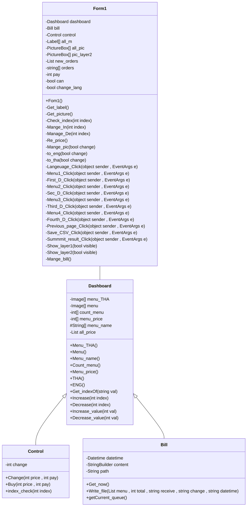

#### ความเป็นมาของโปรแกรม
โปรแกรมได้รับแรงบันดาลใจจากร้าน NobiCha จากบิ๊กซีอัศวรรณ ผู้ทำจัดสร้างขึ้นเพื่อสร้างเป็นต้นแบบโปรแกรมสำหรับผู้ขายโดยเฉพาะ ซึ่งสามารถใช้เพื่อเป็นตัวช่วยการขายให้กับผู้ค้าได้

### วัตถุประสงค์ของโปรแกรม
เป็นตัวช่วยการขายให้กับผู้ค้าของร้านชานมไข่มุก

### โครงสร้างของโปรแกรม

### ผู้พัฒนาโปรแกรม
นายชัยยุตม์ ถาวร 663450037-1